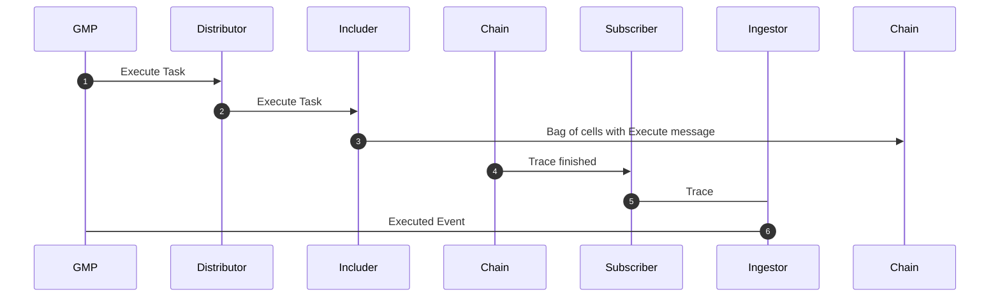

# TON Relayer

Relayer has four primary components:

- **Subscriber** – Reads from the chain and publishes tasks to RabbitMQ.
- **Distributor** – Reads upcoming tasks from the GMP API and publishes them to RabbitMQ.
- **Ingestor** – Consumes tasks from RabbitMQ published by the Subscriber, handling on-chain events.
- **Includer** – Consumes tasks from RabbitMQ published by the Distributor, handling tasks from the GMP API.

## Brief TON overview

- **Message** – A unit of communication in TON, containing instructions sent to a smart contract to trigger execution or
  state changes.
- **Transaction** – The result of a contract processing a message, including state updates and any outgoing messages.
- **Trace** – The chain of linked messages and transactions showing how execution flows across multiple contracts.

Execution in TON is asynchronous. Without gas limits, a transaction trace could continue
indefinitely. [Learn more about TON transactions here](https://docs.ton.org/v3/documentation/smart-contracts/message-management/messages-and-transactions).

## Subscriber

The Subscriber uses the [Toncenter V3 Indexer API](https://toncenter.com/api/v3/index.html) to fetch on-chain events. It
monitors:

- Axelar Gateway contract
- Gas Service contract
- ITS contract

Because a trace may span multiple contracts, each trace is stored in `ton_traces`. It is processed only if it has not
been stored before, or if it has changed since the last time.

A trace changes if it goes from `incomplete` to `completed` status. A **complete trace** means all outgoing messages
have resulted in confirmed incoming transactions. Only complete traces are processed.

The Subscriber
uses [logical time](https://docs.ton.org/v3/documentation/smart-contracts/message-management/messages-and-transactions#what-is-a-logical-time)
for pagination.

## Ingestor

The Ingestor reads traces from the queue and runs each transaction through a parser defined in the `transaction_parser`
directory. Each parser must:

1. Determine whether it should handle the transaction.
2. Create an event to send to the GMP API.

### Example: Call Contract Parser

`parser_call_contract.rs` implements `ParserCallContract` with two methods:

- **`is_match`** – Confirms the transaction happened on *our* Axelar Gateway contract and that the correct log event was
  emitted. This prevents attackers from spoofing events by passing unrelated logs through the contract.
- **`event`** – Extracts the event from the log and maps it to a GMP API event. Logs in TON are outgoing messages to a
  `null` destination and may carry an op-code. Depending on the log, we check either the op-code directly or the op-code
  of an incoming message to verify the event.

Logs are parsed by deserializing
TON’s [Bag of Cells](https://docs.ton.org/v3/documentation/data-formats/tlb/cell-boc#bag-of-cells), using deserializers
from the `boc` directory.

### Multiple Events in a Single Trace

A trace can emit multiple events. Some must share the same `message_id`. Examples:

- A **Gas Paid** event must accompany a **Contract Call** event with the same `message_id`.
- Every **ITS Event** must be paired with a **Call Contract** event in the same trace.

To keep in line with EVM relayer, Contract Call events and Gas Paid events are linked by key (determined by payload
hash, destination chain and destination address).
ITS events are only linked to Call Contract events they accompany by the order of their appearance.

To accommodate for connecting events, `event` method on `Parser` optionally accepts `message_id`. If this id is present,
Event's message_id should be set to it. Otherwise, the parser should determine its own `message_id`.

Likewise, a parser that will be connected by key to another one needs to implement `key` method.

Once all events are extracted, they are sent to the GMP API.

## Distributor

The Distributor fetches unseen tasks from the GMP API and enqueues them in RabbitMQ.

## Includer

The Includer consumes tasks from RabbitMQ and sends corresponding messages to the chain via the Toncenter API. Messages
are serialized using Bag of Cells (`boc` directory) and sent through a highload wallet.

Because TON execution is asynchronous, the Includer does not wait for the resulting trace. Instead, the Subscriber later
picks it up, and the Ingestor parses it before sending an event to the GMP API.

### Example Flow: Execute Message

### Highload Wallet

[Highload Wallet v3](https://github.com/ton-blockchain/highload-wallet-contract-v3/tree/main) allows rapid sending of
messages. Regular wallet requires confirmation before another message can be sent, and highload wallet does not have
that limitation.

Highload wallet requires us to keep track of query_id for each message, which is composed of bit and shift number.

These are kept in the PostgreSQL database.

## Gas Estimation and Refund

In TON, gas estimation is not trivial, or even possible. A common pattern is to overpay for gas and then to expect the
contract to refund you.

`gas_estimator.rs` handles this. Call Contract and Approve Messages are sent unconditionally.

Execute Message is sent to the chain only if we estimate that there is enough gas balance remaining. Since ITS contracts
require, on a safe side, 0.25 TON to execute, this is the minimum we will require of balance. If the payload of the
Execute message is much bigger than usual, we will use a calculation based on the payload size.

This calculation is experience-based and tries to always overestimate, in line with Ton's logic of expecting a refund.

After a message has been executed, whatever the Executable contract hasn't refunded to the relayer is a cost to us and
we consider it when calculating how much gas was used to send to GMP API.  