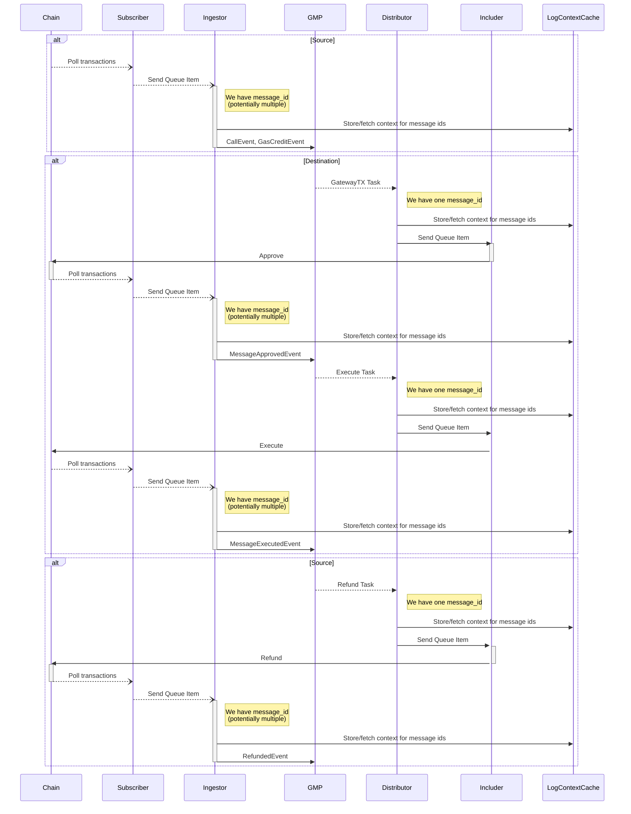

We are using `tracing` crate for tracing with `tracing_opentelemetry` crate to create a subscriber which will export data to 
opentelemetry compatible system.

Distributed tracing (traces that span multiple binaries) is handled differently for spanning RabbitMQ and GMP API calls.

- To continue a trace between services when the intermediary is RabbitMQ tracing context is sent as headers in RabbitMQ tasks.
- To continue a trace between services where GMP API is intermediary, we use tracing context stored in Redis cache.

## Redis cache

Tracing context is stored in cache such that `message_id` is key, and value is the tracing context. Distributor
and ingestor, at earliest times when we know the `message_id`, will check if there is a context for said `message_id`
in Redis. If it is, they will use it, otherwise, they will write their own context into Redis for it.

An issue is that certain actions will carry multiple `message_id`s. E.g. `GATEWAY_TX` task can contain multiple messages or a single transaction
read by subscriber can contain multiple CALL or GAS_CREDIT events for different messages. In this case, we will connect
the current context to the first `message_id` context that we find in Redis.

# Tracing flow

An example shows end-to-end message tracing for Ton network. Ton network requires that any request sent to
the chain be checked asynchronously. It demonstrates a GMP flow in which Ton is both the source and the destination
chain.

- Open arrows show polling actions
- Dotted lines denote "blind spots"
- RabbitMQ is ommitted, all communication via queues is predictably instrumented.




# Tracing and logging recommendations

To enable tracing, add to your config file: 

```yaml
jaeger_grpc_url: "http://localhost:4317"
```

## Use tracing crate for all logging

Using `tracing::info!`, `tracing::warn!`, `tracing::error!`, etc. creates events that are attached to spans. 

Use `info_span!` to create a new span programmatically, but prefer to annotate functions that will definitely need 
tracing with `#[tracing::instrument(level = "info")]`.

## Async gotchas with tracing

"In asynchronous code that uses async/await, Span::Enter should be used very carefully or avoided entirely." (https://docs.rs/tracing/latest/tracing/struct.Span.html#in-asynchronous-code)

E.g. imagine if you call:

```rust
use std::thread::yield_now;

async fn wrong() {
    let wrongs_span = info_span!("my_async_function");
    wrongs_span.enter();
    another_function().await
}

async fn another_function() {
    yield_now();
}

async fn unrelated_loop() {
    loop {
        let span = Span::current();
        tokio::time::slep(Duration::from_millis(100));
    }
}
```

`wrong` will start a span, then execute `another_function`, which will yield at some point. When it does yield, unrelated
loop will be in `wrongs_span`'s context.

Instead use these approaches:

### Sync code from async

```rust
async fn my_async_function() {
    let span = info_span!("my_async_function");
    let some_value = span.in_scope(|| {
        // run some synchronous code inside the span...
    });
    // This is okay! The span has already been exited before we reach
    // the await point.
    some_other_async_function(some_value).await;
    // ...
}
```

### Async from async

```rust
async fn my_async_function() {
    let span = info_span!("my_async_function");
    async move {
       other_async_function().await;
    }
      .instrument(span)
      .await
}
```

- If you are calling your own async function, you can decorate the function with #[instrument] attribute macro:
```rust
#[tracing::instrument(level = "info")]
async fn my_async_function() {
    some_other_async_function().await;
}
```

If you are calling a decorated function from a function that is not decorated, make sure to pass the parent context by
calling `.instrument` on it:

```rust
async fn parent() {
    let span = info_span!("parent span");
    child.instrument(span).await;
}

#[tracing::instrument(level = "info")]
async fn child() {
    some_other_async_function().await;
}
```
